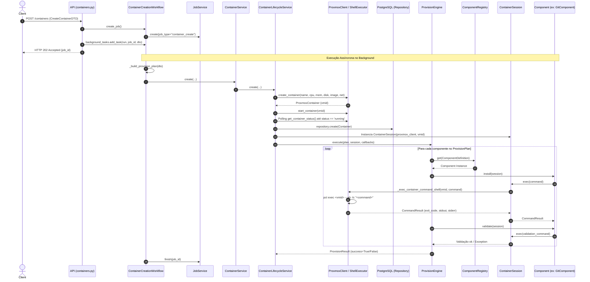

# Arquitetura de Provisionamento do Agent (LXC Container Provisioning Flow)

Este documento descreve detalhadamente a arquitetura atual do **Agent** (`proxmox-manager-api`), focando no fluxo que transforma a requisição de **"Criar Container"** na **"Execução de Comandos Internos"** e no provisionamento de componentes.

---

## 1. Estrutura de Diretórios Relevante

Abaixo está a estrutura de diretórios do projeto focada na jornada de provisionamento:

```text
proxmox-manager-api/
├── alembic.ini                        # Configuração do Alembic para migrations
├── migrations/                        # Histórico de migrations do banco local (SQLAlchemy/Alembic)
│   └── versions/
├── app/
│   ├── main.py                        # Ponto de entrada FastAPI e ciclo de vida (lifespan/reconciliação)
│   ├── api/
│   │   └── containers.py              # Endpoint POST /containers (recebe requisição de criação)
│   ├── components/                    # Abstração de Componentes do sistema
│   │   ├── base_components.py         # Interface abstrata BaseComponent
│   │   ├── base_system_component.py  # Implementação base para SO Debian/Ubuntu
│   │   ├── definition.py              # DTO/Model ComponentDefinition
│   │   ├── registry.py                # ComponentRegistry (mapeia nomes para classes)
│   │   ├── git_component.py           # Exemplo de componente (Git)
│   │   ├── curl_component.py          # Exemplo de componente (Curl)
│   │   └── tailscale_component.py     # Exemplo de componente (Tailscale)
│   ├── provision/                     # Engine de Provisionamento
│   │   ├── plan.py                    # Classe ProvisionPlan
│   │   ├── engine.py                  # ProvisionEngine (executa install e validate)
│   │   ├── step.py                    # ProvisionStep (estado de cada passo)
│   │   └── result.py                  # ProvisionResult (resultado consolidado)
│   ├── services/                      # Camada de Regra de Negócio
│   │   ├── container_creation_workflow.py # Workflow assíncrono acionado pelo Job
│   │   ├── container_service.py       # Facade principal de operações de container
│   │   ├── job_service.py             # Gerenciador de Jobs assíncronos
│   │   └── container/
│   │       ├── container_lifecycle_service.py # Criação, boot, sync e destruição Proxmox
│   │       ├── container_network_service.py   # Configuração de rede (IP, CIDR, Bridge)
│   │       └── container_sync_service.py      # Sincronização de status com Proxmox
│   ├── integrations/
│   │   └── proxmox/                   # Integração com a infraestrutura local do Proxmox VE
│   │       ├── proxmox_client.py      # Cliente principal Proxmox (API + CLI)
│   │       ├── container_session.py   # Sessão administrativa para execução de comandos (exec/exec_many)
│   │       └── shell_executor.py      # Subprocess wrapper para chamadas de CLI (pct, pvesh, qm)
│   ├── models/                        # Modelos ORM SQLAlchemy (PostgreSQL local)
│   │   ├── container.py               # Modelo Container
│   │   ├── job.py                     # Modelo Job (status, progresso, output)
│   │   └── ...
│   ├── repositories/                  # Repositórios (Abstração DB)
│   │   ├── container_repository.py
│   │   ├── job_repository.py
│   │   └── base_repository.py
│   └── database/
│       ├── session.py                 # Conexão SQLAlchemy com PostgreSQL local
│       └── create_tables.py
```

---

## 2. Fluxo Principal: "Criar Container" → "Executar Coisas Dentro Dele"

O diagrama a seguir sintetiza a sequência completa:



---

## 3. Detalhamento dos Componentes-Chave

### 3.1. Entrada / Principal & Workflow
- **`app/api/containers.py`**: O endpoint `POST /containers` recebe a requisição com especificações do container e lista de componentes desejados (`dto.components`). Cria um `Job` no banco local com status `PENDING` e delega a execução para o `ContainerCreationWorkflow.run` em background (FastAPI `BackgroundTasks`).
- **`app/services/container_creation_workflow.py`**: 
  1. Converte a lista de nomes de componentes em objetos `ComponentDefinition`.
  2. Constrói um `ProvisionPlan`.
  3. Prepara *callbacks* de ciclo de vida e progresso (que atualizam o progresso do `Job` de 0% a 100% no banco local e emitem eventos via WebSocket/SSE).
  4. Invoca o `ContainerService.create(...)`.

### 3.2. ContainerService & ContainerLifecycleService
- **`app/services/container_service.py`**: Atua como um *Facade* unificado para gerenciamento de containers LXC. Repassa a responsabilidade de criação e provisionamento para o `ContainerLifecycleService`.
- **`app/services/container/container_lifecycle_service.py`**:
  1. Constrói e valida as configurações de rede (`ContainerNetworkService`).
  2. Invoca o `ProxmoxClient.create_container(...)` enviando parâmetros como CPU, memória, disco, bridge e template de imagem OS.
  3. Invoca `ProxmoxClient.start_container(...)` para ligar o container LXC.
  4. Executa um *loop de polling* aguardando o status do container ficar `"running"`.
  5. Salva o registro no banco de dados PostgreSQL local via `ContainerRepository`.
  6. Cria a sessão administrativa: `session = ContainerSession(proxmox_client, proxmox_container.container_id)`.
  7. Invoca o **`ProvisionEngine.execute(plan=plan, session=session, ...)`**.

### 3.3. Execução de Comandos no Container (`pct exec`)
O Agent executa comandos dentro do container **sem necessidade de agente SSH/agente interno pré-instalado no guest**. A execução ocorre diretamente no host via **CLI de LXC do Proxmox (`pct exec`)**:

1. **`ContainerSession.exec(command, timeout, raise_on_error)`** ([container_session.py](file:///home/douglas/Documents/project_tcc/proxmox-manager-api/app/integrations/proxmox/container_session.py)):
   - Encapsula chamadas ao `ProxmoxClient.exec`.
   - Oferece também `exec_many(commands: list[str])` que encerra no primeiro comando que falhar.
2. **`ProxmoxClient._exec_container_command_shell(...)`** ([proxmox_client.py](file:///home/douglas/Documents/project_tcc/proxmox-manager-api/app/integrations/proxmox/proxmox_client.py#L691)):
   - Invoca o `ShellExecutor.pct`:
     ```python
     self.shell_executor.pct(
         "exec",
         container_id,
         "--",
         "sh",
         "-lc",
         command,
         timeout=timeout,
         raise_on_error=raise_on_error,
     )
     ```
3. **`ShellExecutor`** ([shell_executor.py](file:///home/douglas/Documents/project_tcc/proxmox-manager-api/app/integrations/proxmox/shell_executor.py)):
   - Executa no SO host o comando subprocess: `pct exec <container_id> -- sh -lc "<command>"`.
   - Garante limpeza e padronização de variáveis de ambiente (`LC_ALL=C.UTF-8`).
   - Retorna um `CommandResult` com `exit_code`, `stdout`, `stderr`, `duration` e `success`.

### 3.4. Como o Agent Representa um Componente atualmente
- **Interface Base (`BaseComponent`)** ([base_components.py](file:///home/douglas/Documents/project_tcc/proxmox-manager-api/app/components/base_components.py)):
  Contrato abstrato que define 4 métodos obrigatórios:
  - `install(self, session: ContainerSession) -> str | None`: Executa a instalação enviando comandos shell via `session.exec(...)`.
  - `validate(self, session: ContainerSession) -> str | None`: Valida a instalação executando checagens no container (ex: `git --version`).
  - `rollback(self, session: ContainerSession) -> str | None`: Desfaz alterações em caso de erro.
  - `metadata(self) -> dict`: Retorna metadados como nome, descrição e versão.

- **Componente de Sistema Base (`BaseSystemComponent`)** ([base_system_component.py](file:///home/douglas/Documents/project_tcc/proxmox-manager-api/app/components/base_system_component.py)):
  Especialização de `BaseComponent` que prepara a imagem base Debian/Ubuntu (instala `curl`, `wget`, `ca-certificates`, ajusta locales `en_US.UTF-8` e timezone `UTC`).

- **Registro de Componentes (`ComponentRegistry`)** ([registry.py](file:///home/douglas/Documents/project_tcc/proxmox-manager-api/app/components/registry.py)):
  Mapeia chaves simples em string (`"git"`, `"tailscale"`, `"curl"`, `"echo"`, `"dummy"`) para as suas respectivas classes implementadoras de `BaseComponent`.

### 3.5. ProvisionPlan & ProvisionEngine
- **`ProvisionPlan`** ([plan.py](file:///home/douglas/Documents/project_tcc/proxmox-manager-api/app/provision/plan.py)):
  Objeto simples contendo metadados (`id`, `name`, `description`) e uma lista de `ComponentDefinition` (ex: `[ComponentDefinition(name="git"), ComponentDefinition(name="tailscale")]`).
- **`ProvisionEngine`** ([engine.py](file:///home/douglas/Documents/project_tcc/proxmox-manager-api/app/provision/engine.py)):
  1. Itera sobre cada componente do `ProvisionPlan`.
  2. Obtém a instância do componente no `ComponentRegistry.get(definition)`.
  3. Cria e gerencia o ciclo de vida do `ProvisionStep` (`pending` → `running` → `success` / `error`).
  4. Executa `component.install(session=session)`.
  5. Executa `component.validate(session=session)`.
  6. Dispara os *callbacks* de progresso configurados.
  7. Retorna um `ProvisionResult` contendo o resultado consolidado da execução, tempo decorrido e lista de passos.

---

## 4. Banco de Dados Local, Repositórios, Modelos e Migrations

- **Banco de Dados**: PostgreSQL local do Agent (configurado na variável `DATABASE_URL` no `.env`).
- **Sessão / Conexão**: `app/database/session.py` utiliza SQLAlchemy ORM (`create_engine`, `sessionmaker`).
- **Modelos ORM (`app/models/`)**:
  - `Container` (`app/models/container.py`): Armazena dados do container no Agent, incluindo `id` (UUID), `container_number` (VMID no Proxmox), `name`, `password`, `status`, `cpu`, `memory_mb`, `disk_gb`, `ip_address`, `bridge`, `ip_mode`, `cidr`, `gateway`, `vlan`, `created_by`, timestamps e relacionamentos.
  - `Job` (`app/models/job.py`): Registra tarefas assíncronas (`type`, `status`, `progress`, `current_step`, `current_component`, `output`, `error`, `target_container`).
  - Outros modelos: `User`, `OsTemplate`, `ContainerAction`, `AuditLog`, `TailscaleNode`, `AccessToken`.
- **Repositórios (`app/repositories/`)**:
  - `ContainerRepository`: Métodos de manipulação em banco (`create`, `get`, `get_by_name`, `list`, `update`, `delete`).
  - `JobRepository`: Atualização de progresso e estado das tarefas.
- **Migrations (Alembic)**:
  - Configuração principal: `alembic.ini` e `migrations/env.py`.
  - Migrações armazenadas em `migrations/versions/`.
  - Novas tabelas/colunas são adicionadas criando os modelos SQLAlchemy em `app/models/` e rodando:
    ```bash
    alembic revision --autogenerate -m "nome_da_migration"
    alembic upgrade head
    ```

---

## 5. O que Podemos Reaproveitar para a Nova Arquitetura

Para os novos requisitos de arquitetura (ex: inclusão de `DatabaseComponent`, `ProgrammingComponent`, novas tabelas, etc.), a estrutura atual **já oferece bases prontas para reúso**:

| Componente Atual | Status | Como Reaproveitar |
| :--- | :---: | :--- |
| **`ContainerSession` + `pct exec`** | **Pronto para Uso** | Já resolve 100% da execução de comandos dentro do container. Não é necessário criar outra forma de comunicação SSH/CLI. |
| **`BaseComponent`** | **Pronto para Uso** | Toda nova abstração (`DatabaseComponent`, `ProgrammingComponent`) pode herdar de `BaseComponent` ou extender um contrato especializado derivado dele. |
| **`ComponentRegistry`** | **Pronto para Uso** | Basta registrar as novas classes (ex: `PostgresDatabaseComponent`, `NodeJSComponent`, `PythonComponent`) no dicionário do `ComponentRegistry`. |
| **`ProvisionEngine` & `ProvisionPlan`** | **Pronto para Uso** | Já suportam múltiplos componentes sequenciais, tratamento de erro, passo a passo (`ProvisionStep`), validação (`validate`) e notificação de progresso via callbacks. |
| **`ContainerCreationWorkflow` + `JobService`** | **Pronto para Uso** | O sistema de Jobs assíncronos já rastreia o progresso do provisionamento e notifica via WebSocket. |
| **Padrão de Models & Repositories + Alembic** | **Pronto para Uso** | Toda nova tabela (ex: configurações de banco ou ambientes de programação) segue o padrão estabelecido em `app/models/` + `app/repositories/` + migrações Alembic. |

---

## 6. Resumo do Caminho do Provisionamento

Para recapitular o caminho direto solicitado:

$$\text{"Criar Container"} \longrightarrow \text{Workflow / Job} \longrightarrow \text{Proxmox Client (pct create/start)} \longrightarrow \text{ContainerSession (pct exec)} \longrightarrow \text{ProvisionEngine} \longrightarrow \text{BaseComponent.install() / validate()}$$

1. **Client chama API** `POST /containers`.
2. **Workflow cria o container no Proxmox VE** (`pct create` e `pct start`) e aguarda status `running`.
3. **Agent persiste o container no PostgreSQL local**.
4. **Agent abre uma `ContainerSession`** associada ao `container_number` (VMID).
5. **`ProvisionEngine` itera sobre a lista de componentes do `ProvisionPlan`**.
6. **Cada componente executa seus comandos de instalação e validação dentro do container usando `pct exec`**.
7. **Workflow finaliza o `Job` com sucesso**.
