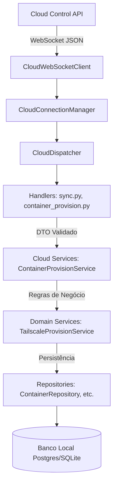

# Análise Técnica e Reflexiva do Agent Atual (Sincronização Cloud ↔ Agent)

## Visão Geral

Este documento apresenta uma análise técnica e reflexiva minuciosa do **Agent** (`proxmox-manager-api`), focando exclusivamente nos componentes e fluxos que serão impactados pela futura sincronização de estado entre a **Cloud Control API** e o Agent local.

Nenhuma alteração de código ou banco de dados foi realizada nesta etapa. A análise reflete rigorosamente a implementação atual da base de código.

---

## 1. Identificação do Ambiente e Autenticação do Agent

### Como ocorre a autenticação do Agent com a Cloud
1. **Registro do Token**: O usuário/administrador registra o `environment_token` na API local via endpoint `POST /cloud/register` ([app/api/cloud.py](file:///home/douglas/Documents/project_tcc/proxmox-manager-api/app/api/cloud.py#L20-L61)).
2. **Criptografia Simétrica**: O token recebido (`AgentRegistrationDTO` em [app/cloud/dto.py](file:///home/douglas/Documents/project_tcc/proxmox-manager-api/app/cloud/dto.py#L39-L43)) é criptografado usando Fernet ([app/cloud/crypto.py](file:///home/douglas/Documents/project_tcc/proxmox-manager-api/app/cloud/crypto.py)) com a chave `CLOUD_ENCRYPTION_KEY` e armazenado na tabela local `agent_settings` ([app/cloud/models.py](file:///home/douglas/Documents/project_tcc/proxmox-manager-api/app/cloud/models.py#L10-L48)).
3. **Obtenção do JWT**: O `CloudConnectionManager` ([app/cloud/connection_manager.py](file:///home/douglas/Documents/project_tcc/proxmox-manager-api/app/cloud/connection_manager.py#L101-L152)) invoca o `CloudAuthService.renew_jwt()` ([app/cloud/auth_service.py](file:///home/douglas/Documents/project_tcc/proxmox-manager-api/app/cloud/auth_service.py#L63-L71)), que descriptografa o `environment_token` em memória e realiza uma requisição HTTP `POST {CLOUD_URL}/agent/auth`.
4. **Estabelecimento de Sessão WebSocket**: A Cloud retorna um JWT (`access_token`) e um tempo de expiração (`expires_in`). O JWT é salvo em `agent_settings.jwt` e utilizado para conectar na rota WebSocket da Cloud: `{CLOUD_URL}/ws/agent?token={JWT}` ([app/cloud/websocket_client.py](file:///home/douglas/Documents/project_tcc/proxmox-manager-api/app/cloud/websocket_client.py#L28-L41)).

### Onde a identidade/ambiente é armazenada
- **Banco de Dados Local**: Tabela SQLAlchemy `agent_settings` ([app/cloud/models.py](file:///home/douglas/Documents/project_tcc/proxmox-manager-api/app/cloud/models.py)).
- **Colunas**: `id` (UUIDv4 gerado localmente pelo Agent), `environment_token_encrypted`, `jwt`, `jwt_expires_at`, `registered_at`, `created_at`, `updated_at`.

### Quais dados identificam de forma confiável que o Agent pertence a determinado ambiente
- **Na Cloud**: O `environment_token` emitido previamente pelo painel da Cloud. Quando o Agent envia este token no `/agent/auth`, a Cloud valida e associa a conexão WebSocket ao `environment_id` correspondente na infraestrutura remota.
- **No Agent**: O Agent **não armazena explicitamente** um `environment_id` vindo da Cloud. O campo `AgentSettings.id` é um UUID localmente gerado. Quando o Agent envia o snapshot do ambiente ([app/cloud/sync_service.py](file:///home/douglas/Documents/project_tcc/proxmox-manager-api/app/cloud/sync_service.py#L31-L38)), ele informa seu `settings.id` interno como `environment.id`.

### Riscos de confiar em informações fornecidas pelo próprio Agent
- **Insegurança de Payload**: Se a Cloud confiar no `environment.id` enviado no payload das mensagens do Agent (ex: snapshot de `environment.sync`), haverá risco de falsificação ou desconexão lógica, pois o Agent pode gerar qualquer UUID local.
- **Princípio da Autoridade**: A fonte da verdade sobre a qual ambiente pertence aquela conexão é a **sessão WebSocket autenticada pelo JWT na Cloud** (claims da sessão), e **não** os atributos `id` informados nos payloads JSON do Agent.

---

## 2. Representação Atual de Conexões e Clientes no Agent

### Estrutura de Armazenamento e Modelos
1. **Sessão de Conexão de Infraestrutura (Agent ↔ Cloud)**:
   - Mantida em memória via `CloudWebSocketClient._connection` ([app/cloud/websocket_client.py](file:///home/douglas/Documents/project_tcc/proxmox-manager-api/app/cloud/websocket_client.py#L22)) e orquestrada pelo singleton `cloud_manager` ([app/cloud/manager.py](file:///home/douglas/Documents/project_tcc/proxmox-manager-api/app/cloud/manager.py#L66)).
2. **Containers Gerenciados**:
   - Tabela `containers` ([app/models/container.py](file:///home/douglas/Documents/project_tcc/proxmox-manager-api/app/models/container.py)): armazena os containers Proxmox locais (`id`, `container_number`, `name`, `status`, `ip_address`, `created_by`, etc.).
3. **Nós VPN / Conexões Publicadas (Tailscale / Headscale)**:
   - Tabela `tailscale_nodes` ([app/tailscale/model.py](file:///home/douglas/Documents/project_tcc/proxmox-manager-api/app/tailscale/model.py)): relação 1:1 com `containers`. Armazena o registro de integração do container na rede VPN (`machine_id`, `node_key`, `tailscale_ip`, `installed`, `service_running`, `status_json`).
4. **Tokens de Acesso a Containers**:
   - Tabela `access_tokens` ([app/access/model.py](file:///home/douglas/Documents/project_tcc/proxmox-manager-api/app/access/model.py)): armazena credenciais/tokens de segurança gerados para expor/autenticar o acesso aos serviços do container (`container_id`, `token_hash`, `expires_at`, `active`, `revoked_at`).
5. **Usuários Locais**:
   - Tabela `users` ([app/models/user.py](file:///home/douglas/Documents/project_tcc/proxmox-manager-api/app/models/user.py)): usuários cadastrados no Agent local (`id`, `username`, `email`, `role`, `password_hash`).

### Significado de "Conexão" no Agent
Atualmente existem dois conceitos distintos de "conexão":
- **Conexão WebSocket de Controle**: Canal bidirecional persistente onde o Agent atua como cliente assíncrono conectado à Cloud Control API.
- **Conexão / Exposição do Container (Publicação)**: Um container é considerado "publicado" ou conectado quando possui um registro associado em `tailscale_nodes` ([app/cloud/published_container_service.py](file:///home/douglas/Documents/project_tcc/proxmox-manager-api/app/cloud/published_container_service.py#L20-L80)).

### Estados Existentes
- **Estado do WebSocket**: `OPEN`, `CLOSED`, gerido internamente pelo `CloudConnectionManager` com tratamento de tentativas de reconexão (*backoff exponencial* de 5s, 10s, 30s, 60s).
- **Estado do Agent (Settings)**: `registered` (indica se possui `environment_token_encrypted`) e `jwt_valid` (se a expiração do JWT é maior que a hora atual).
- **Estado do Container**: `status` (`running`, `stopped`, etc.) e `online` (booleano inferido do `status_json['Self']['Online']` do Tailscale).
- **Estado do AccessToken**: `active` (`True`/`False`), `expires_at` e `revoked_at`.

### Informações Reutilizáveis
- `TailscaleNode`: Pode ser estendido ou reutilizado para refletir o nó do ambiente no Headscale/Tailscale gerenciado pela Cloud.
- `Container`: Já possui `container_number` (VMID do Proxmox) e UUID primário (`id`), mas **não possui** campo para vincular ao `container_id` da Cloud.
- `User`: Estrutura simples em `users` que atualmente não reflete identidades ou usuários da Cloud.

---

## 3. Como o Agent Recebe Informações da Cloud

### Endpoints e Protocolos Utilizados
- **Troca de Token / HTTP**: `POST {CLOUD_URL}/agent/auth` via `httpx.AsyncClient` ([app/cloud/auth_service.py](file:///home/douglas/Documents/project_tcc/proxmox-manager-api/app/cloud/auth_service.py#L34-L39)).
- **Conexão Principal de Comando / WebSocket**: `ws://{CLOUD_URL}/ws/agent?token={JWT}` via `websockets.connect` ([app/cloud/websocket_client.py](file:///home/douglas/Documents/project_tcc/proxmox-manager-api/app/cloud/websocket_client.py#L31-L39)).

### Mecanismo de Comunicação (WebSocket Reativo vs. Polling)
- **Não há Polling HTTP**: O Agent não faz requisições periódicas via GET/POST HTTP para consultar alterações na Cloud.
- **WebSocket Reativo (Push/Command)**: O Agent abre uma conexão WebSocket cliente e executa um loop de escuta contínuo `_listen_loop()` ([app/cloud/connection_manager.py](file:///home/douglas/Documents/project_tcc/proxmox-manager-api/app/cloud/connection_manager.py#L154-L185)).
- **Roteamento de Mensagens**: Cada mensagem recebida é desserializada pelo `parse_message()` ([app/cloud/protocol.py](file:///home/douglas/Documents/project_tcc/proxmox-manager-api/app/cloud/protocol.py#L9-L17)) no DTO `CloudMessage(request_id, type, payload)`. O `CloudDispatcher` ([app/cloud/dispatcher.py](file:///home/douglas/Documents/project_tcc/proxmox-manager-api/app/cloud/dispatcher.py#L28-L44)) busca o handler registrado para o `message.type` e o executa.

### Tipos de Mensagens Recebidas Atualmente
1. `"heartbeat"` → Responde `"heartbeat.response"` ([app/cloud/handlers/heartbeat.py](file:///home/douglas/Documents/project_tcc/proxmox-manager-api/app/cloud/handlers/heartbeat.py)).
2. `"system.info"` → Responde `"system.info.response"` com uptime, SO e versão ([app/cloud/handlers/system.py](file:///home/douglas/Documents/project_tcc/proxmox-manager-api/app/cloud/handlers/system.py)).
3. `"environment.sync"` → Responde com snapshot dos containers publicados ([app/cloud/handlers/sync.py](file:///home/douglas/Documents/project_tcc/proxmox-manager-api/app/cloud/handlers/sync.py)).
4. `"container.provision"` → Executa provisionamento do Tailscale no container local ([app/cloud/handlers/container_provision.py](file:///home/douglas/Documents/project_tcc/proxmox-manager-api/app/cloud/handlers/container_provision.py)).

### Persistência dos Dados Recebidos
- No evento `container.provision`, o handler valida o DTO `ContainerProvisionPayloadDTO` e chama `ContainerProvisionService.provision_container()` ([app/cloud/container_provision_service.py](file:///home/douglas/Documents/project_tcc/proxmox-manager-api/app/cloud/container_provision_service.py#L51-L121)).
- O serviço busca o container local por `container_id` (`api_local_container_id`), valida elegibilidade e delega para o `TailscaleProvisionService` ([app/tailscale/provision_service.py](file:///home/douglas/Documents/project_tcc/proxmox-manager-api/app/tailscale/provision_service.py)), persistindo as alterações no banco de dados local (tabelas `containers` e `tailscale_nodes`).

### Como o Agent sabe quais dados pertencem ao seu ambiente
- O Agent é fisicamente e logicamente **Single-Environment**. Ele assume que toda mensagem recebida em sua conexão WebSocket individualizada é destinada ao seu ambiente.
- O Agent **não valida** se o `environment_id` enviado em payloads como `container.provision` corresponde ao seu registro local. Ele busca a entidade diretamente no seu banco de dados interno pelo ID local.

---

## 4. Como o Agent Atualiza seu Estado Local

### Serviços Responsáveis e Camadas da Arquitetura



- **Camada de Transporte e Despacho**: `CloudWebSocketClient`, `CloudConnectionManager`, `CloudDispatcher`.
- **Camada de Handlers / Entrada**: `app/cloud/handlers/` (`container_provision.py`, `sync.py`, `heartbeat.py`, `system.py`).
- **Camada de DTOs e Protocolo**: `app/cloud/dto.py` e `app/cloud/protocol.py`.
- **Camada de Serviços de Integração Cloud**: `ContainerProvisionService`, `EnvironmentSyncService`, `PublishedContainerService`.
- **Camada de Serviços de Domínio Local**: `TailscaleProvisionService`, `ContainerService`, `ComponentService`.
- **Camada de Persistência**: `AgentSettingsRepository`, `ContainerRepository`, `TailscaleNodeRepository`, `SessionLocal`.

### Infraestrutura Reutilizável para Sincronização Incremental
1. **Barramento de Eventos Interno (`InternalEventBus`)**: Localizado em [app/core/event_bus.py](file:///home/douglas/Documents/project_tcc/proxmox-manager-api/app/core/event_bus.py#L128-L159). Permite publicar e subscrever eventos síncronos/assíncronos dentro do processo do Agent (`internal_event_bus.subscribe`, `internal_event_bus.publish`).
2. **Publicador com Debounce (`EnvironmentChangedPublisher`)**: Localizado em [app/cloud/publisher.py](file:///home/douglas/Documents/project_tcc/proxmox-manager-api/app/cloud/publisher.py). Já escuta eventos internos de alteração de ambiente (`EnvironmentChanged` e `ContainerProvisionCompleted`) e dispara uma notificação `environment.changed` via WebSocket para a Cloud após uma janela de debounce de 5 segundos.
3. **Arquitetura Command/Registry do Dispatcher**: O `CloudDispatcher` pode registrar dinamicamente qualquer nova instrução/evento vindo da Cloud sem alterar a estrutura de rede.

---

## 5. Pontos de Extensão para a Sincronização (Cloud → Sync → Agent → Estado Local)

Para implementar futuramente o fluxo **Cloud → Sync → Agent → Atualização de Estado Local**, os seguintes pontos da arquitetura atual devem ser estendidos:

```
[ Cloud Control API ]
         │ (WebSocket Envelope JSON)
         ▼
[ CloudDispatcher ] ── (Registo de Novo Handler)
         │
         ▼
[ Sync State Handler ] ── (Validação via Pydantic DTO)
         │
         ▼
[ CloudStateSyncService ] ── (Reconciliação: Target State vs Local State)
         │
         ├───▶ [ ContainerRepository / UserRepo / AccessTokenRepo ]
         └───▶ [ InternalEventBus ] ──▶ [ EnvironmentChangedPublisher ]
```

1. **Definição de DTOs em `app/cloud/dto.py`**:
   - Criar estruturas para mensagens de delta/sincronização de estado (ex: `StateSyncPayloadDTO`, `ContainerSyncDeltaDTO`, etc.).
2. **Registro de Novo Handler em `app/cloud/manager.py`**:
   - Adicionar o registro do novo comando no `CloudManager.__init__()`:
     `self._dispatcher.register("environment.sync_state", EnvironmentSyncStateHandler.handle)`
3. **Novo Handler em `app/cloud/handlers/`**:
   - Criar handler fino responsável por receber o envelope, tratar validações e repassar ao serviço de sincronização.
4. **Serviço de Reconciliação de Estado (`app/cloud/sync_service.py` ou novo `state_sync_service.py`)**:
   - Comparar o estado desejado (*desired state*) enviado pela Cloud com o estado atual (*actual state*) do banco local do Agent.
   - Orquestrar a criação, atualização ou remoção de entidades locais chamando os repositórios/serviços de domínio.
5. **Emissão de ACK e Publicação no `internal_event_bus`**:
   - Disparar confirmações para a Cloud e notificar componentes locais sobre as mudanças efetuadas.

---

## 6. Análise de Segurança

### Isolamento entre Ambientes
- O Agent opera de forma **Single-Environment**. Ele não possui isolamento multi-tenant interno porque atende a um único servidor/cluster Proxmox.
- O isolamento depende criticamente de a Cloud garantir que o WebSocket do Agent receba apenas dados pertinentes ao seu `environment_token`.

### Autenticação e Armazenamento de Credenciais
- O `environment_token` é armazenado no banco local criptografado com Fernet (`CLOUD_ENCRYPTION_KEY`). Se a chave não estiver configurada no `.env`, o Agent falha ao inicializar.
- O JWT de sessão tem renovação automática controlada pelo Agent 60 segundos antes da expiração.

### Autorização e Endpoints Locais
- **Vulnerabilidade Local**: Os endpoints HTTP locais de configuração do Agent em `app/api/cloud.py` (`/cloud/register`, `/cloud/reconnect`) **não exigem autenticação**. Qualquer entidade na rede local do Agent com acesso à porta da API pode sobrescrever o `environment_token`.

### Risco de Receber Dados de Outro Ambiente
- **Ausência de Validação de Tenant no Agent**: Se por erro de roteamento na Cloud uma mensagem destinada a outro ambiente for enviada ao WebSocket deste Agent, o Agent **não rejeitará a mensagem com base no `environment_id`**, pois ele não valida este campo contra seu registro local. O Agent tentará processar o payload imediatamente.

### Confiabilidade de Identificadores (`environment_id`, `user_id`)
- O Agent gera seus próprios UUIDs primários para `Container`, `User` e `AgentSettings`.
- Atualmente não há mapeamento de chaves estrangeiras entre IDs remotos da Cloud e IDs locais do Agent. Se a Cloud enviar um `user_id` da Cloud no payload, o Agent causará erro de chave estrangeira se tentar salvar diretamente na coluna `containers.created_by` sem o devido mapeamento.

---

## 7. Análise de Desempenho e Sincronização Incremental

### Situação Atual
- **Agent → Cloud**: Dispara `environment.changed` via debounce (5s) quando há alterações. Porém, quando a Cloud solicita a foto do ambiente (`environment.sync`), o Agent constrói e envia um **snapshot completo (full snapshot)** de todos os containers e tokens.
- **Cloud → Agent**: O envio de comandos como `container.provision` já é pontual/granular.

### Mecanismos Reutilizáveis para Sincronização Incremental (Deltas)
- A infraestrutura baseada em `CloudMessage` + `CloudDispatcher` é perfeita para trafegar deltas (mensagens específicas para `create`, `update`, `delete`).
- O `internal_event_bus` permite reagir pontualmente a cada mudança sem a necessidade de reprocessar todo o estado.

### Lacunas de Desempenho / Arquiteturais
- **Falta de Versionamento de Estado**: O Agent não possui um número de sequência (`sequence_id`), timestamp de alteração por entidade (*last_modified*) ou controle de versão de estado local (*state_version*).
- **Incapacidade de Sincronização Parcial por Reconexão**: Se a conexão WebSocket for interrompida e restabelecida, o Agent não consegue solicitar "envie-me apenas as mudanças desde a versão X". Atualmente a única alternativa seria um full sync.

---

## 8. Conclusão e Próximos Passos

### O que já existe e pode ser reutilizado
1. **Conexão WebSocket Resiliente**: `CloudWebSocketClient` e `CloudConnectionManager` com reconexão automática e renovação de JWT.
2. **Padrão Dispatcher**: `CloudDispatcher` limpo e extensível para registrar novos tipos de mensagens.
3. **Barramento Interno de Eventos e Debounce**: `InternalEventBus` e `EnvironmentChangedPublisher`.
4. **Criptografia e Persistência de Registro**: `crypto.py`, `AgentSettingsRepository` e modelo `AgentSettings`.
5. **Serviços de Domínio Isolados**: `ContainerService`, `TailscaleProvisionService` e `PublishedContainerService`.

### O que está faltando
1. Mapeamento explícito de IDs remotos da Cloud (`cloud_environment_id`, `cloud_container_id`, `cloud_user_id`) para as entidades locais do Agent.
2. Validação rigorosa do `environment_id` no Agent para todas as mensagens recebidas via WebSocket.
3. Mecanismo de versionamento de estado local (*state_version* ou *sequence_number*) para permitir sincronizações delta/incrementais.
4. Autenticação e proteção nos endpoints HTTP locais da API (`/cloud/register`, `/cloud/status`).
5. Serviço de reconciliação de estado local (*Desired State vs Actual State*).

### Possíveis Problemas Arquiteturais
- **Divergência no `environment.id`**: O Agent atualmente envia seu UUID local (`AgentSettings.id`) como `environment.id` no snapshot, enquanto a Cloud possui seu próprio ID de ambiente.
- **Risco de Concorrência**: Alterações locais no Proxmox/Agent feitas simultaneamente com comandos vindos da Cloud podem gerar inconsistências de estado sem um mecanismo de lock ou vetor de versão.
- **Acoplamento em Chamadas de Provisionamento**: Chamadas síncronas/bloqueantes a serviços externos (Proxmox API, SSH) precisam continuar isoladas em threads (`asyncio.to_thread`) para não travar o loop do WebSocket.

### Arquivos e Classes Provavelmente Envolvidos na Futura Sincronização
- [app/cloud/models.py](file:///home/douglas/Documents/project_tcc/proxmox-manager-api/app/cloud/models.py) (`AgentSettings`)
- [app/cloud/dto.py](file:///home/douglas/Documents/project_tcc/proxmox-manager-api/app/cloud/dto.py) (Novos DTOs de sincronização de estado)
- [app/cloud/manager.py](file:///home/douglas/Documents/project_tcc/proxmox-manager-api/app/cloud/manager.py) (Registro de novos handlers)
- [app/cloud/handlers/sync.py](file:///home/douglas/Documents/project_tcc/proxmox-manager-api/app/cloud/handlers/sync.py) (Novos handlers de recebimento de estado)
- [app/cloud/sync_service.py](file:///home/douglas/Documents/project_tcc/proxmox-manager-api/app/cloud/sync_service.py) (Implementação do motor de reconciliação de estado)
- [app/models/container.py](file:///home/douglas/Documents/project_tcc/proxmox-manager-api/app/models/container.py) (Inclusão de mapeamentos de IDs da Cloud ou versão)

### Decisões Arquiteturais que Precisam ser Tomadas
1. **Estratégia de Sincronização**: Delta Orientado a Eventos vs. Reconciliação Baseada em Estado Desejado (*Desired State Declarativo*) vs. Abordagem Híbrida.
2. **Modelo de Identificação de Ambiente**: O Agent deve salvar o `environment_id` retornado pela Cloud no ato da autenticação ou a Cloud continuará aceitando a associação mapeada apenas no token?
3. **Resolução de Conflitos**: Qual lado prevalece em caso de divergência de estado (Cloud-wins vs. Agent-wins)?
