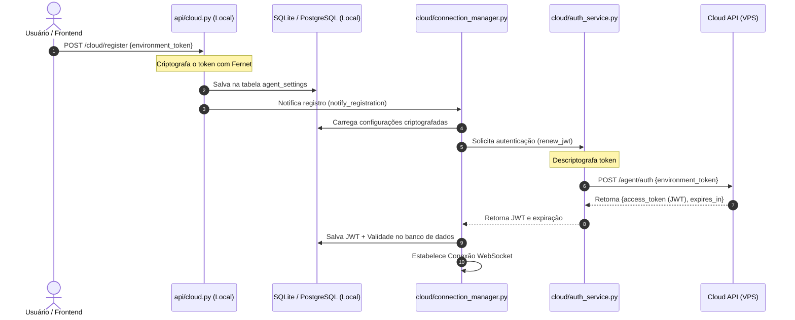

# Integração com a API Cloud: Fluxo de Comunicação e Estrutura do Módulo

Este documento detalha o funcionamento da integração entre a API Local (**Agent**, que gerencia o Proxmox) e a API da **Cloud** (hospedada na VPS).

---

## 📂 Estrutura de Arquivos em `cloud/` e suas Chamadas

O módulo `cloud/` encapsula toda a lógica de autenticação, criptografia, conexão via WebSocket e sincronização com a VPS. A seguir, está o papel de cada arquivo:

### 1. `cloud/manager.py`
* **O que faz:** Funciona como uma fachada (Facade) para o módulo Cloud. Instancia todas as dependências principais (`CloudAuthService`, `CloudWebSocketClient`, `CloudDispatcher` e `CloudConnectionManager`) e registra os gerenciadores de mensagens (handlers).
* **Onde é chamado:** É importado e iniciado/parado no ciclo de vida (`lifespan`) da aplicação FastAPI em `app/main.py` ([main.py](file:///home/douglas/Documents/project_tcc/proxmox-manager-api/app/main.py#L30-L37)).

### 2. `cloud/auth_service.py`
* **O que faz:** Gerencia a autenticação HTTP com a Cloud. Envia o `Environment Token` via POST `/agent/auth` para obter um JWT (token de acesso temporário) e controla a expiração e renovação desse token.
* **Onde é chamado:** Instanciado no `cloud/manager.py` e utilizado pelo `CloudConnectionManager` para obter ou renovar o JWT.

### 3. `cloud/websocket_client.py`
* **O que faz:** Cliente WebSocket puro, construído sobre a biblioteca `websockets`. Trata unicamente da conexão física, do envio e do recebimento de strings brutos e do fechamento da conexão, sem nenhuma regra de negócio.
* **Onde é chamado:** Instanciado no `cloud/manager.py` e utilizado pelo `CloudConnectionManager`.

### 4. `cloud/connection_manager.py`
* **O que faz:** O orquestrador principal da conexão de rede. Cuida de:
  * Verificar a validade do JWT e disparar renovação se necessário.
  * Iniciar a conexão WebSocket.
  * Rodar o loop assíncrono de escuta (`_listen_loop`).
  * Tratar reconexões automáticas com uma política de *backoff exponencial* (esperas de 5, 10, 30 e 60 segundos).
* **Onde é chamado:** Instanciado no `cloud/manager.py` e notificado pelo endpoint `/cloud/register` em `api/cloud.py` quando um novo token é configurado.

### 5. `cloud/dispatcher.py`
* **O que faz:** Roteia as mensagens recebidas da Cloud baseando-se no campo `type` da mensagem, direcionando-as aos seus respectivos handlers registrados.
* **Onde é chamado:** Instanciado no `cloud/manager.py` e acionado pelo `CloudConnectionManager` no loop de escuta.

### 6. `cloud/protocol.py`
* **O que faz:** Define a lógica de serialização e desserialização das mensagens seguindo o protocolo de envelopes acordado. Contém funções utilitárias como `parse_message`, `build_response` e `build_error`.
* **Onde é chamado:** Usado no `CloudConnectionManager` para ler mensagens e nos handlers para montar as respostas/erros enviadas à VPS.

### 7. `cloud/dto.py`
* **O que faz:** Contém as estruturas de dados (Pydantic Models) que representam as mensagens enviadas/recebidas e o formato dos snapshots exportados para a Cloud (Ex: `CloudMessage`, `CloudResponse`, `PublishedContainerSnapshotDTO`, etc.).
* **Onde é chamado:** Importado por todo o módulo cloud para validação de dados e tipagem.

### 8. `cloud/crypto.py`
* **O que faz:** Criptografia simétrica usando Fernet (`cryptography`). Protege o `Environment Token` gravado localmente no banco de dados usando a chave `CLOUD_ENCRYPTION_KEY`.
* **Onde é chamado:**
  * Usado na API `/cloud/register` ([api/cloud.py](file:///home/douglas/Documents/project_tcc/proxmox-manager-api/app/api/cloud.py#L36)) para criptografar o token recebido antes de salvar no banco.
  * Usado em `cloud/auth_service.py` ([auth_service.py](file:///home/douglas/Documents/project_tcc/proxmox-manager-api/app/cloud/auth_service.py#L70)) para descriptografar o token para renovar o JWT.

### 9. `cloud/models.py`
* **O que faz:** Define o modelo SQLAlchemy `AgentSettings` para a tabela `agent_settings`, persistindo o token criptografado, o JWT atual e sua expiração.
* **Onde é chamado:** Usado pelo repositório do Agent.

### 10. `cloud/repository.py`
* **O que faz:** Classe `AgentSettingsRepository` contendo os métodos CRUD (`get`, `save`, `update`) para as configurações do Agent no banco de dados.
* **Onde é chamado:** Utilizado pelo `CloudConnectionManager`, `EnvironmentSyncService` e pela API do roteador `api/cloud.py`.

### 11. `cloud/sync_service.py`
* **O que faz:** Gera um snapshot completo do ambiente (`EnvironmentSnapshotDTO`), unindo as informações básicas do agente e a lista de containers publicados obtidos via `PublishedContainerService`.
* **Onde é chamado:** Chamado por `cloud/handlers/sync.py` ao receber o evento de sincronização.

### 12. `cloud/published_container_service.py`
* **O que faz:** Filtra e busca os containers do Proxmox cadastrados localmente que estão publicados (ou seja, associados a um nó Tailscale). Mapeia estes containers incluindo os dados de rede do Tailscale e os access tokens ativos/revogados do container.
* **Onde é chamado:** Utilizado no `cloud/sync_service.py`.

### 13. Handlers (`cloud/handlers/`)
* `cloud/handlers/heartbeat.py`: Responde rapidamente a mensagens do tipo `heartbeat` com `heartbeat.response` para manter a conexão ativa e checar saúde.
* `cloud/handlers/system.py`: Coleta informações do sistema operacional local (hostname, uptime, plataforma) e responde ao tipo `system.info` com `system.info.response`.
* `cloud/handlers/sync.py`: Atende ao tipo `environment.sync`, gerando o snapshot do ambiente e enviando à Cloud.

---

## 🔑 Autenticação e Fluxo de Inicialização

O processo se inicia com o registro do **Environment Token** do cliente, que vincula este Agent físico à conta da VPS Cloud.



### Detalhes Importantes de Autenticação:
* **O que o Agent envia para a Cloud (VPS):** O `environment_token` bruto, descriptografado em memória apenas no momento da requisição HTTP POST `/agent/auth`.
* **O que o Agent recebe da Cloud:** Um JSON contendo:
  ```json
  {
    "access_token": "eyJhbGciOi...",
    "expires_in": 3600
  }
  ```
* **Onde o JWT é usado:** No cabeçalho/parâmetro de query ao conectar na rota WebSocket da VPS: `ws://vps-ip/ws/agent?token=JWT`.

---

## 📡 Fluxo de Comunicação WebSocket (Mensagens e Respostas)

Após a conexão WebSocket ser estabelecida, ela permanece aberta. O fluxo de controle é majoritariamente **reativo** (a Cloud envia requisições/comandos, e o Agent processa e responde).

### Estrutura de Envelope das Mensagens (JSON)

Qualquer mensagem que trafega no WebSocket segue um padrão estrutural (envelope).

1. **Mensagem Recebida da Cloud (`CloudMessage`):**
```json
{
  "request_id": "uuid-da-requisicao",
  "type": "tipo.da.mensagem",
  "payload": { ... }
}
```

2. **Mensagem de Sucesso Enviada à Cloud (`CloudResponse`):**
```json
{
  "request_id": "uuid-da-requisicao",
  "origin": "agent",
  "success": true,
  "type": "tipo.da.mensagem.response",  // Opcional
  "payload": { ... }
}
```

3. **Mensagem de Erro Enviada à Cloud (`CloudError`):**
```json
{
  "request_id": "uuid-da-requisicao",
  "origin": "agent",
  "success": false,
  "error": {
    "code": "CODIGO_DO_ERRO",
    "message": "Descrição amigável do erro"
  }
}
```

---

## 🔄 Fluxos de Pedidos e Respostas Existentes

Atualmente, existem três tipos de mensagens que a Cloud pode enviar para o Agent através do WebSocket:

### A. Monitoramento de Conexão (`heartbeat`)
* **Fluxo:**
  1. A Cloud envia uma mensagem com `"type": "heartbeat"`.
  2. O `CloudDispatcher` encaminha para `HeartbeatHandler`.
  3. O Agent responde imediatamente com:
     ```json
     {
       "request_id": "request-id-original",
       "origin": "agent",
       "success": true,
       "type": "heartbeat.response",
       "payload": {}
     }
     ```

### B. Informações do Sistema (`system.info`)
* **Fluxo:**
  1. A Cloud envia `"type": "system.info"`.
  2. O `CloudDispatcher` encaminha para `SystemHandler`.
  3. O Agent coleta os dados do sistema operacional local e envia como resposta:
     ```json
     {
       "request_id": "request-id-original",
       "origin": "agent",
       "success": true,
       "type": "system.info.response",
       "payload": {
         "hostname": "nome-da-maquina",
         "agent_version": "0.1.0",
         "uptime": 12345,
         "platform": "Linux",
         "platform_version": "5.15.0-generic"
       }
     }
     ```

### C. Sincronização do Ambiente (`environment.sync`)
* **Fluxo:**
  1. A Cloud envia `"type": "environment.sync"`.
  2. O `CloudDispatcher` encaminha para `EnvironmentSyncHandler`.
  3. O Agent monta um snapshot contendo as informações da máquina e de todos os containers ativos publicados (via Tailscale) e seus respectivos tokens de acesso local.
  4. O Agent responde com o snapshot:
     ```json
     {
       "request_id": "request-id-original",
       "origin": "agent",
       "success": true,
       "payload": {
         "environment": {
           "id": "uuid-do-agente",
           "registered_at": "2026-07-19T14:57:25Z"
         },
         "published_containers": [
           {
             "api_local_container_id": "uuid-do-container",
             "container_number": 101,
             "name": "meu-container-exposto",
             "status": "running",
             "tailscale": {
               "installed": true,
               "service_running": true,
               "version": "1.34.0",
               "machine_id": "ts-mid-xxx",
               "node_key": "mkey:xxx",
               "tailscale_ip": "100.64.0.5",
               "online": true,
               "last_sync": "2026-07-19T14:55:00Z"
             },
             "access_tokens": [
               {
                 "id": "uuid-token",
                 "token_hash": "sha256-hash...",
                 "created_at": "2026-07-19T10:00:00Z",
                 "expires_at": "2026-07-20T10:00:00Z",
                 "active": true,
                 "revoked_at": null
               }
             ]
           }
         ]
       }
     }
     ```
     *(Nota: Como visto no `EnvironmentSyncHandler`, o campo `type` é omitido na resposta para obedecer à especificação de sincronização da Cloud).*

---

## 📊 Dados Acessados do Lado do Agent

Ao rodar localmente no servidor/proxmox, o módulo cloud lê e sincroniza as seguintes entidades do banco de dados local:
1. **Configuração do Agente (`agent_settings`):** ID do ambiente local e tokens criptografados.
2. **Containers Publicados (`containers`):** Filtrados por aqueles que possuem um registro na tabela `tailscale_nodes` (o que indica que estão integrados à rede VPN privada).
3. **Nós do Tailscale (`tailscale_nodes`):** Status de instalação do cliente VPN dentro do container, IP do Tailscale atribuído, se o serviço está ativo e chave pública.
4. **Access Tokens do Container (`access_tokens`):** Tokens gerados pelo Agent local que permitem o tráfego autenticado para o container e sua API interna.
