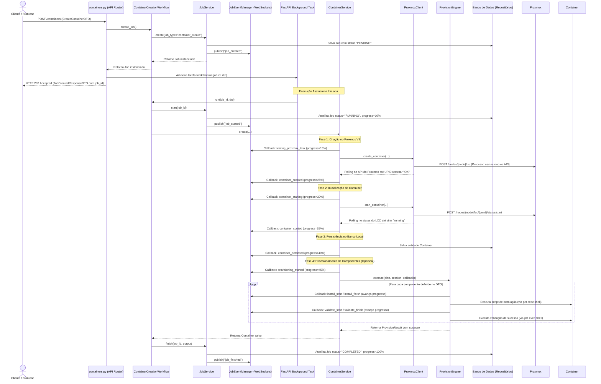

# Detalhamento Lógico: Criação de Containers e Gerenciamento de Jobs

Este documento apresenta uma análise detalhada da arquitetura e fluxo lógico para a criação de containers LXC no Proxmox, bem como o sistema de rastreamento de tarefas (Jobs) em tempo real da aplicação.

---

## 1. Visão Geral da Arquitetura

O sistema adota uma abordagem assíncrona para operações de longa duração (como criação e provisionamento de containers), respondendo imediatamente ao cliente HTTP com um identificador de Job e processando a tarefa em segundo plano.

O fluxo é dividido em quatro camadas principais:
1. **API Layer**: Recebe as requisições HTTP, inicia os Jobs e delega o processamento pesado para threads de segundo plano.
2. **Workflow Layer**: Orquestra as etapas de criação, persistência e provisionamento, atualizando o progresso do Job no banco de dados.
3. **Core Services**: Contém as regras de negócio para gerenciar containers no banco local (`sqlite`/`postgres`) e no Proxmox VE.
4. **Integration/Provisioning Layer**: Comunica-se com as APIs e CLI do Proxmox (`pct`) e executa a instalação e validação de pacotes internos (components) no container.

---

## 2. Diagrama de Sequência Lógica

O diagrama abaixo ilustra o fluxo completo de chamadas desde a requisição do usuário até a conclusão do provisionamento do container.



---

## 3. Passo a Passo Detalhado do Fluxo

### 3.1. Chamada Inicial (POST `/containers`)
1. O usuário faz uma requisição HTTP POST para `/containers` contendo os dados definidos em [CreateContainerDTO](file:///home/douglas/Documents/project_tcc/proxmox-manager-api/app/dto/request/create_container.py).
2. O endpoint [containers.py](file:///home/douglas/Documents/project_tcc/proxmox-manager-api/app/api/containers.py#L37-L55) injeta a classe [ContainerCreationWorkflow](file:///home/douglas/Documents/project_tcc/proxmox-manager-api/app/services/container_creation_workflow.py).
3. Uma entidade [Job](file:///home/douglas/Documents/project_tcc/proxmox-manager-api/app/models/job.py) é inicializada com status `"PENDING"` e gravada no banco de dados através da chamada do [JobService.create](file:///home/douglas/Documents/project_tcc/proxmox-manager-api/app/services/job_service.py#L24-L47).
4. O [JobService](file:///home/douglas/Documents/project_tcc/proxmox-manager-api/app/services/job_service.py) publica o evento `"job_created"` utilizando o gerenciador de eventos em tempo real [job_event_manager](file:///home/douglas/Documents/project_tcc/proxmox-manager-api/app/services/job_events.py#L14-L78).
5. O endpoint agenda a execução assíncrona do método `workflow.run(job.id, dto)` usando a infraestrutura do `BackgroundTasks` do FastAPI e retorna imediatamente a resposta HTTP 202 com o ID do Job para o usuário.

### 3.2. Ciclo de Vida do Job no Background Task
Durante a execução de `workflow.run(...)`, o sistema executa o processo principal e notifica o usuário sobre o progresso através de WebSockets:

1. **Início do Job (Progresso: 10%):** O método `self.job_service.start(job_id)` é chamado, atualizando o status do Job para `"RUNNING"`.
2. **Criação do Container no Proxmox (Progresso: 15% - 25%):**
   - O [ContainerService.create](file:///home/douglas/Documents/project_tcc/proxmox-manager-api/app/services/container_service.py#L55-L250) é invocado.
   - O [ProxmoxClient.create_container](file:///home/douglas/Documents/project_tcc/proxmox-manager-api/app/integrations/proxmox/proxmox_client.py#L174-L280) obtém o próximo ID de container livre (`vmid`) e executa um POST no Proxmox VE.
   - O Proxmox retorna um identificador único de tarefa (UPID). A aplicação aguarda em loop de polling até a conclusão da tarefa de criação. Se a API falhar, há um mecanismo de fallback para execução via comandos SSH CLI (`pct create`).
3. **Inicialização do Container (Progresso: 30% - 35%):**
   - Executa o comando para iniciar o container ([ProxmoxClient.start_container](file:///home/douglas/Documents/project_tcc/proxmox-manager-api/app/integrations/proxmox/proxmox_client.py#L132-L144)).
   - Realiza polling (verificações repetidas a cada segundo) até que o status do container no Proxmox mude de `stopped` para `running`.
4. **Persistência Local (Progresso: 40%):**
   - Salva os dados do container criado (IP, ID de container, recursos alocados, etc.) na tabela `containers` do banco de dados através do `ContainerRepository`.
5. **Provisionamento de Componentes (Progresso: 45% - 90%):**
   - Inicia o fluxo do [ProvisionEngine](file:///home/douglas/Documents/project_tcc/proxmox-manager-api/app/provision/engine.py).
   - O motor de provisionamento obtém uma sessão administrativa [ContainerSession](file:///home/douglas/Documents/project_tcc/proxmox-manager-api/app/integrations/proxmox/container_session.py), que permite rodar comandos dentro do container usando a CLI `pct exec` do host do Proxmox.
   - Para cada componente solicitado (ex: `tailscale`, `curl`, etc.), a engine executa os métodos `install()` e `validate()` do componente herdado de [BaseComponent](file:///home/douglas/Documents/project_tcc/proxmox-manager-api/app/components/base_components.py).
   - O progresso avança incrementalmente a cada componente iniciado, instalado e validado.
6. **Conclusão (Progresso: 100%):**
   - Com o sucesso de todas as etapas, o workflow invoca `job_service.finish(...)`, marcando o Job como `"COMPLETED"`.
   - Se ocorrer qualquer exceção no caminho, a transação captura a falha e invoca `job_service.fail(...)`, marcando o status do Job para `"FAILED"` com a descrição do erro no banco.

---

## 4. O Sistema de Transmissão de Eventos de Jobs (WebSockets)

Para que o usuário saiba o andamento exato da criação sem precisar fazer múltiplas consultas HTTP (pooling), o sistema expõe uma rota WebSocket em [jobs.py](file:///home/douglas/Documents/project_tcc/proxmox-manager-api/app/api/jobs.py#L50-L110).

1. O cliente estabelece uma conexão WebSocket no endpoint `/jobs/{job_id}/stream`.
2. A rota assina a fila de atualizações no gerenciador de eventos global:
   ```python
   queue = await job_event_manager.subscribe(job_id)
   ```
3. O WebSocket envia um `"job_snapshot"` inicial contendo o estado atual do Job gravado no banco.
4. Conforme o workflow em segundo plano executa suas etapas nas threads do FastAPI, ele chama métodos do `JobService` (como `update_progress`), que disparam eventos para o `job_event_manager`.
5. O [JobEventManager](file:///home/douglas/Documents/project_tcc/proxmox-manager-api/app/services/job_events.py#L14-L78) recebe os dados das atualizações e publica de forma segura (usando `loop.call_soon_threadsafe` para lidar com threads externas) na fila `asyncio.Queue` do WebSocket correspondente.
6. A conexão WebSocket recebe as novas mensagens e repassa como JSON para o frontend.
7. Quando o Job atinge o status `"COMPLETED"` ou `"FAILED"`, a conexão é finalizada e limpa a assinatura do canal no gerenciador global para evitar vazamento de memória.
