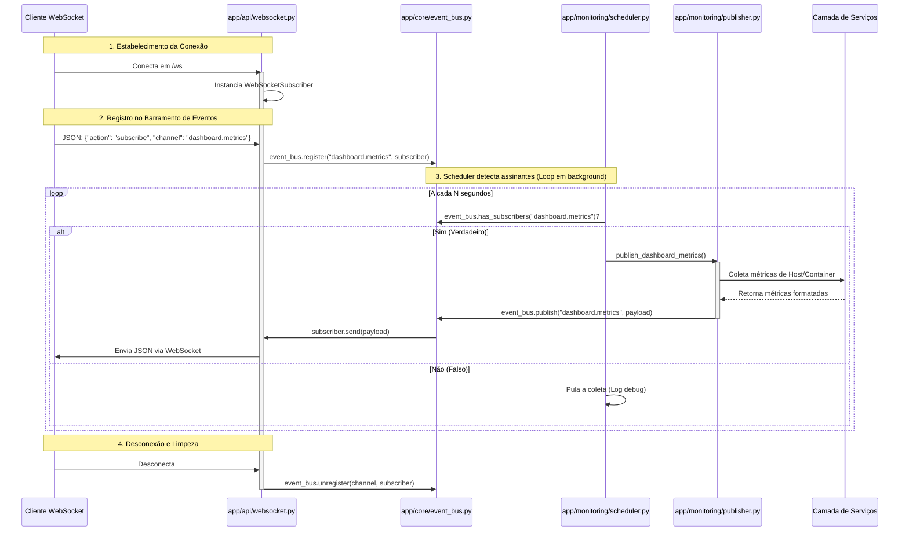

Listed directory proxmox-manager-api
Listed directory app
Listed directory api
Listed directory monitoring
Viewed websocket.py:1-49
Viewed metrics_collector.py:1-48
Viewed publisher.py:1-161
Viewed scheduler.py:1-108
Viewed event_bus.py:1-102

Entendi como o ecossistema de WebSockets e monitoramento da sua API está estruturado. A arquitetura implementada é muito robusta e adota o padrão **Pub/Sub (Publish-Subscribe)** mediado por um Barramento de Eventos ([EventBus](file:///home/douglas/Documents/project_tcc/proxmox-manager-api/app/core/event_bus.py#L30)).

Abaixo, explico detalhadamente o funcionamento desse fluxo e apresento uma análise de como ele se alinha com a arquitetura de camadas e separação de responsabilidades do seu projeto.

---

### 1. Fluxo de Funcionamento do WebSocket e Monitoramento

O ciclo de vida do WebSocket e a publicação de métricas em tempo real funcionam de forma cooperativa e orientada a eventos. O diagrama abaixo ilustra essa dinâmica:

#### Passo 1: Estabelecimento e Gestão da Conexão
* O endpoint de entrada é o [websocket_endpoint](file:///home/douglas/Documents/project_tcc/proxmox-manager-api/app/api/websocket.py#L10) no arquivo [websocket.py](file:///home/douglas/Documents/project_tcc/proxmox-manager-api/app/api/websocket.py).
* Assim que a conexão WebSocket é aceita, um objeto [WebSocketSubscriber](file:///home/douglas/Documents/project_tcc/proxmox-manager-api/app/core/event_bus.py#L12) é criado encapsulando a conexão do cliente.
* O endpoint mantém o controle de quais canais o cliente se inscreveu em `subscribed_channels`. Se o cliente desconectar, o bloco `finally` garante que todas as assinaturas sejam removidas do barramento global via `event_bus.unregister(...)`, evitando vazamento de memória (*memory leaks*).

#### Passo 2: O Barramento de Eventos (Event Bus)
* O [event_bus](file:///home/douglas/Documents/project_tcc/proxmox-manager-api/app/core/event_bus.py#L101) gerencia a relação entre canais de texto e assinantes ([Subscriber](file:///home/douglas/Documents/project_tcc/proxmox-manager-api/app/core/event_bus.py#L8)).
* Quando o cliente envia uma mensagem como `{"action": "subscribe", "channel": "dashboard.metrics"}`, o endpoint registra aquele cliente específico no canal escolhido.

#### Passo 3: O Agendador de Segundo Plano (Scheduler)
* O [MonitoringScheduler](file:///home/douglas/Documents/project_tcc/proxmox-manager-api/app/monitoring/scheduler.py#L19) roda loops assíncronos contínuos (`asyncio.create_task`) em intervalos definidos (ex: 2.0s para o painel de métricas, 1.0s para containers individuais).
* **Otimização Reativa:** Antes de chamar o Proxmox para buscar métricas de forma cara, o Scheduler consulta o barramento via `event_bus.has_subscribers(channel)`. Se nenhum cliente WebSocket estiver ouvindo aquele canal, o agendamento pula a chamada I/O, otimizando drasticamente os recursos e requisições no servidor Proxmox.

#### Passo 4: Coleta, Publicação e Distribuição
* Se houver algum inscrito, o Scheduler invoca o [MonitoringPublisher](file:///home/douglas/Documents/project_tcc/proxmox-manager-api/app/monitoring/publisher.py#L12).
* O Publisher interage com os serviços de domínio (`HostMonitoringService` e `ContainerMonitoringService`), coleta e consolida as métricas na thread-pool do asyncio (`run_in_executor`) para evitar travar a API, calcula as taxas diferenciais (ex: velocidade de rede) e gera o payload.
* O Publisher dispara `await event_bus.publish(channel, payload)`, que itera sobre todos os assinantes do canal enviando os dados de forma concorrente. No caso de conexões WS, o método `send()` do subscriber dispara `websocket.send_json(data)`.

---

### 2. Análise Arquitetural: Divisão de Responsabilidades e Desacoplamento

Essa solução segue de maneira exemplar uma **arquitetura de camadas bem definida e desacoplada**. As responsabilidades estão claramente separadas:

| Camada / Componente | Arquivo Relacionado | Função e Desacoplamento |
| :--- | :--- | :--- |
| **Apresentação / Rede (FastAPI)** | [websocket.py](file:///home/douglas/Documents/project_tcc/proxmox-manager-api/app/api/websocket.py) | **Gerencia apenas a conexão de rede.** Ele desconhece como as métricas são buscadas ou processadas. Sua única tarefa é escutar eventos de rede (conexão/desconexão/mensagens do cliente) e gerenciar a presença no barramento. |
| **Barramento de Eventos (Mediator Pattern)** | [event_bus.py](file:///home/douglas/Documents/project_tcc/proxmox-manager-api/app/core/event_bus.py) | **Comunicação indireta.** Serve como uma ponte abstrata. O barramento não sabe que existe um FastAPI enviando mensagens ou que existe um Scheduler produzindo-as; ele apenas lida com a abstração `Subscriber`. |
| **Orquestração de Monitoramento** | [scheduler.py](file:///home/douglas/Documents/project_tcc/proxmox-manager-api/app/monitoring/scheduler.py) e [publisher.py](file:///home/douglas/Documents/project_tcc/proxmox-manager-api/app/monitoring/publisher.py) | **Agendamento e formatação de dados.** O Scheduler controla o *timing* de execução e a reatividade. O Publisher traduz as métricas tipadas de domínio para os modelos de payload que a UI/WebSocket espera receber, encaminhando-as ao Barramento. |
| **Domínio / Lógica de Negócio (Serviços)** | `app/monitoring/services/...` | **Contém a regra de negócio de monitoramento.** Interage com o Proxmox por meio de adaptadores específicos de coleta. Essa camada não sabe o que é um WebSocket, nem a frequência ideal de amostragem. Ela simplesmente expõe métodos como `get_metrics()`. |

#### Pontos de Destaque da Arquitetura:
1. **Desacoplamento pelo Padrão Observer:** Se amanhã você quiser adicionar outra forma de consumir essas métricas (como salvar em um banco de dados de séries temporais como InfluxDB ou enviar para uma fila RabbitMQ), basta criar um novo tipo de `Subscriber` (ex: `DatabaseSubscriber`) e registrá-lo no `event_bus`. A lógica de WebSocket ou o Scheduler não precisarão ser alterados.
2. **Robustez e Autocura:** Se uma conexão WebSocket cair abruptamente sem disparar o evento de desconexão normal do FastAPI, o método interno `_safe_send` do [EventBus](file:///home/douglas/Documents/project_tcc/proxmox-manager-api/app/core/event_bus.py#L30) capturará a falha de envio e removerá automaticamente o assinante do canal para evitar vazamento de memória.
3. **Padrão Adapter:** O [MetricsCollector](file:///home/douglas/Documents/project_tcc/proxmox-manager-api/app/monitoring/metrics_collector.py#L14) funciona perfeitamente como um adaptador de inicialização para não poluir o arquivo [main.py](file:///home/douglas/Documents/project_tcc/proxmox-manager-api/app/main.py), mantendo o código de inicialização da API limpo.

Em resumo, **o código segue com rigor os padrões de arquitetura corporativa e separação de responsabilidades**. As camadas se comunicam através de interfaces e abstrações sem dependências acopladas de cima para baixo.